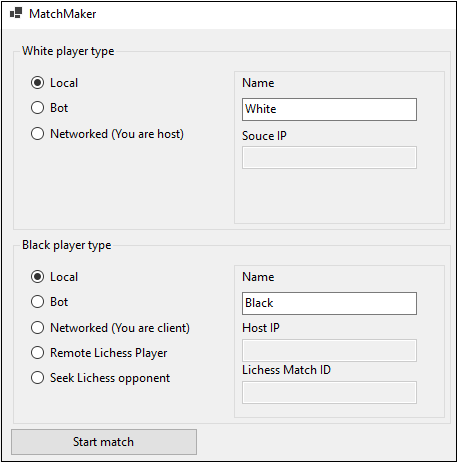

# ChessGame
Chess-engine designed and implemented by my friends, Cogo and Patrick, and I. Features AI opponent (using minimax), Lichess integration and multiplayer-on-LAN.

## How to play
The program has several different gamemodes and playmodes.

### Gamemodes
A gamemode is defined by a change in the rules and/or the starting position of the board. Technically, a gamemode is implemented by deriving from `Gamemode`-class, where custom logic can be implemented by overriding the virtual methods, `StartTurn`, `UpdateGameState`, `ValidateMove`. Currently, no gamemodes make use of overriding the methods.

#### Classic
This is the normal gamemode of chess. All normal rules apply.

There are a couple rules that still need to be implemented, 'Threefold repetition' (#13), '50-move rule' (#17) and forced draw in dead positions (#18).

(insert image of board for consistensy)

#### Horde
Horde plays the same way as regular chess, but white plays only as pawns.

(insert image of board start position)

#### Tiny
Tiny isn't an official gamemode, but a gamemode made to test the bot in positions with fewer moves, but still realistic situations. The queen and one bishop has been removed to make room on a 6x8 board.

(insert image of board)

#### Test gamemodes
The remaining available gamemodes are used for testing, and aren't really playable.

(insert an image of a scenario, maybe multiple images)

### Playmodes
Playmodes are the ways to play a gamemode, locally, remotely or maybe with a bot. Technically, a playmode is defined by a class inheriting from `Player`. The only method that is virtual on this class is `TurnStarted` which expects the class to call Chessboard for the game to continue.

#### Hot-seat
This is the most basic way to play. It works by both players selecting 'local', and then they both make moves by selecting a piece with the UI. The boards rotation is currently fixed, (maybe the board is going to flip every move in the future when #11 has been resolved).

#### Networked / LAN
(Make good description here)

(insert image of setup for player 1)
(insert image fo setup for player 2)

#### Person vs. Bot
(Make good description here)

#### Bot vs. Bot
(Make good description here)

#### Lichess API
(Remember how the Lichess player-class works and make good description here)

(insert image of setup, both Lichess documentation and ChessForms UI)

